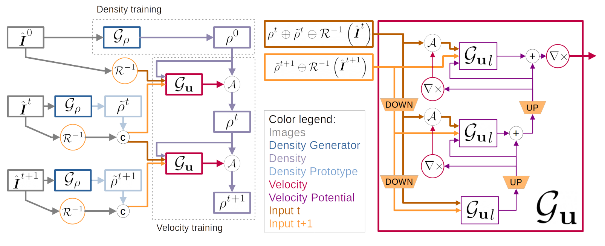

# Neural-Global-Transport
This repository contains the implementation paper [Learning to Estimate Single-View Volumetric Flow Motions without 3D Supervision](https://openreview.net/forum?id=2vmGv5wPDBZ)
  

  


## Requirements

- A Linux system with a Cuda-capable GPU
- CUDA 9.2
- gcc/g++ <= 7.x
- Python 3.6, with packages:
	- numpy 1.17.2
	- Tensorflow-GPU v1.12
	- munch 2.5.0
	- imageio 2.6.0 (with its freeimage binary)

- Install Python and setup the environment via [conda](https://docs.conda.io/en/latest/miniconda.html):
	```
	conda create --name NGT --file NGT_env.txt
	```
	Don't forget to activate the environment:
	```
	conda activate NGT
	```
	(If you get errors regarding missing libraries, try restarting your shell session first.)
- Compile the rendering and advection kernels (requires `g++` and `nvcc` compilers, `nvcc` should come with the conda environment):
	```
	python compile.py
	```
	Alternatively, since the required gcc version is quite old, you can download the compiled kernels from the [releases](https://github.com/tum-pbs/Neural-Global-Transport/releases). Place them into `Neural-Global-Transport/phitest/render/cuda/build`.
- If the 'freeimage' binaries for imageio are not available on your system [download them from Github](https://github.com/imageio/imageio-binaries) OR run
	```
	imageio_download_bin freeimage
	```

## Data
Required training data are videos of moving smoke.
We use the captures of the [ScalarFlow dataset](https://ge.in.tum.de/publications/2019-scalarflow-eckert/) or renderings of a synthetic 3D smoke flow simulated with [Mantaflow](http://mantaflow.com/).
For the example setup you need the first 20 scenes of ScalarFlow in `Neural-Global-Transport/data/ScalarFlow/sim_*`.
Our final models trained for the ScalarFlow dataset can be found in the [releases](https://github.com/tum-pbs/Neural-Global-Transport/releases).
When using your own data, make sure that each frame (esp. the first frame) contains visible density.


## Training
The training procedure consists of training a single-frame Density Generator and then using this pre-trained network to train the Velocity Generator.
We provide example training setups for training with ScalarFlow data in './configs'. Other datasets might need adjusted hyperparameters.

- Train the Density Generator
	```
	python reconstruct_sequence.py --fit --device <GPU-device-id> --setup "configs/setup_density.json"
	```
- Choose the Density Generator to use. `<run-id>` is the 12 digit timestap of the Density Generator training run, e.g. `230501-164242`.  
	Update all mentions of `[RUNID:<run-id>]` in `configs/setup_velocity.json` with your `<run-id>`.
- Train the Velocity Generator
	```
	python reconstruct_sequence.py --fit --device <GPU-device-id> --setup "configs/train_velocity.json"
	```


## Inference
After training the model is evaluated only on a short validation sequence.  
To run a full length inference of our final model on the ScalarFlow data and render the results run:
```
python eval_runs.py -o "eval" --render --simulation 80 --frameRange 20 151 1 -d "runs/train_velDens_sequence" -n "NGT-final_SF80" --evalDataSetup SF --renderDensity --renderTarget -g 64 000000-000001 --device <GPU-device-id>
```
To save the generated volumes add the `--saveVol` flag.


